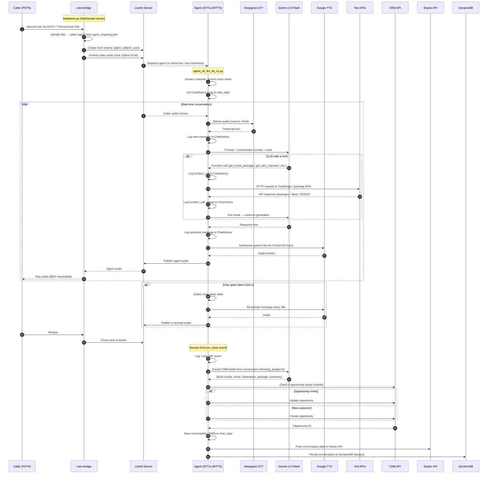
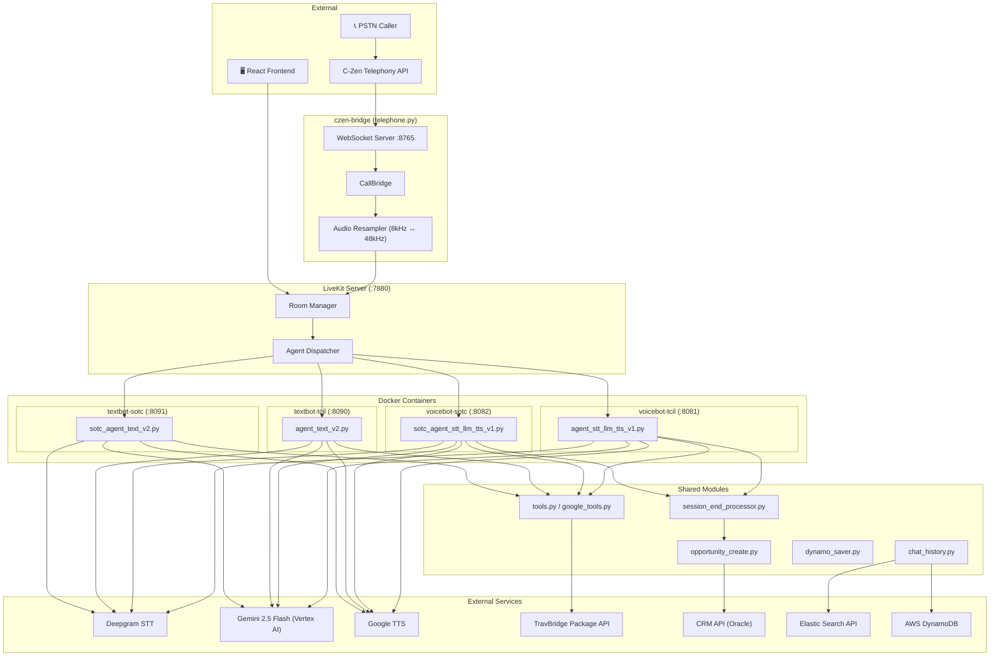
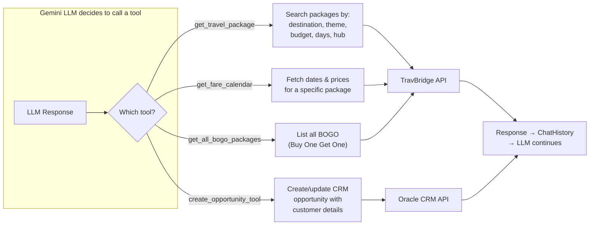
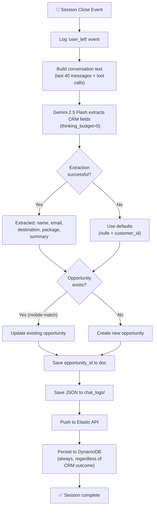

# Travbridge-VoiceBot

Real-time AI-powered VoiceBot and TextBot for **Thomas Cook (TCIL)** and **SOTC** travel brands. Handles inbound PSTN calls and text-based agent-assist sessions, understands customer queries via speech-to-text, responds using an LLM-powered travel agent, and automatically creates CRM opportunities at the end of each session. Conversation data is persisted to **AWS DynamoDB** for durable, queryable storage.

---

## Table of Contents

- [Call Flow](#call-flow)
- [System Architecture](#system-architecture)
- [Tool Call Flow](#tool-call-flow)
- [Session End Processing](#session-end-processing)
- [Project Structure](#project-structure)
- [Technology Stack](#technology-stack)
- [Docker Containers](#docker-containers)
- [Services](#services)
- [Build & Deploy](#build--deploy)
- [Quick Reference](#quick-reference)

---

## Call Flow

End-to-end sequence from inbound PSTN call to CRM opportunity creation. The C-Zen bridge receives the call, creates a LiveKit room, and dispatches the appropriate agent based on the DID number. The agent handles real-time STT → LLM → TTS and logs every interaction to the conversation history.



---

## System Architecture

The system runs four Docker containers — two voice bots and two text bots (TCIL and SOTC), each connecting to the same LiveKit server but handling different brands. Calls are routed to the correct agent based on the DID-to-agent mapping configured in `agent_mapping.json`.



---

## Tool Call Flow

During a conversation, the Gemini LLM can invoke any of the four registered tools. Each tool logs its input arguments and output to the conversation history before returning results to the LLM for continued response generation.

| Tool | Description | API |
|------|-------------|-----|
| `get_travel_package` | Search packages by destination, theme, budget, days, departure city | TravBridge |
| `get_fare_calendar` | Fetch available dates and prices for a specific package | TravBridge |
| `get_all_bogo_packages` | List all active Buy-One-Get-One offers | TravBridge |
| `create_opportunity_tool` | Create or update a CRM lead with customer details | Oracle CRM |



---

## Session End Processing

When a call ends, the `on_close` event fires and triggers `session_end_processor.py`. This module uses Gemini (with `thinking_budget=0` to avoid Vertex AI's thinking-mode issue) to extract structured CRM data from the full conversation — including tool call context. It then creates or updates an opportunity in the CRM, pushes to ElasticSearch, and **always** persists the full conversation to **DynamoDB** (regardless of CRM outcome) for durable storage.



---

## Project Structure

```
Livekit-VoiceBot/
│
├── c-zen-bridge/                  # WebSocket bridge between telephony and LiveKit
│   ├── telephone.py               # Main bridge server (CallBridge, audio relay)
│   ├── agent_mapping.json         # DID → agent name routing
│   ├── audio_uploader.py          # Call audio upload utility
│   └── test.py                    # Bridge test script
│
├── livekit/                       # TCIL (Thomas Cook) agent source
│   ├── agent_stt_llm_tts_v1.py    # Voice bot entry point
│   ├── agent_text_v2.py           # Text/AgentAssist bot entry point
│   ├── aa_prompt.py               # AgentAssist prompt/instructions
│   ├── tools.py                   # Travel package search tools
│   ├── google_tools.py            # Google-based travel tools (destinations, flights, itineraries)
│   ├── opportunity_create.py      # CRM opportunity create/update
│   ├── session_end_processor.py   # Post-call LLM extraction + CRM
│   ├── chat_history.py            # Conversation logging
│   ├── chat_data_updater.py       # Elastic API integration
│   ├── dynamo_saver.py            # AWS DynamoDB conversation persistence
│   ├── prompts.py                 # System prompt / instructions
│   ├── constants.py               # Shared constants
│   ├── app_logger.py              # Logging config
│   ├── configuration/             # Environment config package
│   │   ├── __init__.py
│   │   └── config_env.py          # Env-var loader
│   ├── livekit.yaml               # LiveKit server config
│   ├── .env_dev                   # Dev environment variables
│   ├── .env_prod                  # Production environment variables
│   ├── asvamultiplayer-*.json     # GCP service account credentials
│   └── chat_logs/                 # Persisted conversation logs
│
├── livekit_sotc/                  # SOTC agent source (same structure, different brand)
│   ├── sotc_agent_stt_llm_tts_v1.py  # Voice bot entry point
│   ├── sotc_agent_text_v2.py         # Text/AgentAssist bot entry point
│   ├── sotc_aa_prompt.py             # AgentAssist prompt/instructions
│   ├── sotc_auto_dialer.py           # Outbound auto-dialer
│   ├── convert_xlsx_to_json.py       # Excel-to-JSON converter for call lists
│   ├── tools.py                   # Travel package search tools
│   ├── google_tools.py            # Google-based travel tools
│   ├── opportunity_create.py      # CRM opportunity create/update
│   ├── session_end_processor.py   # Post-call LLM extraction + CRM
│   ├── chat_history.py            # Conversation logging
│   ├── chat_data_updater.py       # Elastic API integration
│   ├── dynamo_saver.py            # AWS DynamoDB conversation persistence
│   ├── prompts.py                 # System prompt / instructions
│   ├── constants.py               # Shared constants
│   ├── app_logger.py              # Logging config
│   ├── configuration/             # Environment config package
│   │   ├── __init__.py
│   │   └── config_env.py          # Env-var loader
│   ├── livekit.yaml               # LiveKit server config
│   ├── .env_dev                   # Dev environment variables
│   ├── .env_prod                  # Production environment variables
│   ├── asvamultiplayer-*.json     # GCP service account credentials
│   └── chat_logs/                 # Persisted conversation logs
│
├── agent-starter-react/           # React frontend (PM2-managed)
│
├── Dockerfile.livekit             # Docker image for TCIL agents (voice + text)
├── Dockerfile.livekit_sotc        # Docker image for SOTC agents (voice + text)
├── requirements.txt               # Python dependencies (pip freeze)
├── .dockerignore                  # Files excluded from Docker build context
└── .gitignore
```

---

## Technology Stack

| Component | Technology | Details |
|-----------|-----------|---------|
| **Speech-to-Text** | Deepgram / Sarvam | `nova-2` model (Hindi); Sarvam `saaras:v3` (codemix) |
| **LLM** | Google Gemini 2.5 Flash | Via Vertex AI (`asia-south1`) |
| **Text-to-Speech** | Google Cloud TTS | `en-IN-Chirp3-HD-Kore` voice |
| **Voice Activity Detection** | Silero VAD | CPU-based, 16kHz sample rate |
| **Turn Detection** | LiveKit Multilingual Model | ONNX model for end-of-turn detection |
| **Media Server** | LiveKit | WebRTC rooms, agent dispatch |
| **Telephony Bridge** | C-Zen + WebSocket | PCM audio relay (8kHz ↔ 48kHz) |
| **Package Search API** | TravBridge | ElasticSearch-backed REST API |
| **CRM** | Oracle Service Cloud | Opportunity create/update/lookup |
| **Conversation Storage** | ElasticSearch | Via TravBridge save API |
| **Conversation Storage** | AWS DynamoDB | Tables: `voice_bot_tc` (TCIL), `voice_bot_sotc` (SOTC) |
| **Runtime** | Python 3.12 | Docker containers |

---

## Docker Containers

The system runs **4 Docker containers** from **2 images**. Each image contains both voice and text bot code; the container's CMD determines which bot runs.

### Container Overview

| Container | Image | Entry Point | Port | Agent Name |
|-----------|-------|-------------|------|------------|
| `voicebot-tcil` | `voicebot-tcil:latest` | `agent_stt_llm_tts_v1.py` | 8081 | `tc-travel-bot` |
| `textbot-tcil` | `voicebot-tcil:latest` | `agent_text_v2.py` | 8090 | `tc-text-travel-bot-v2` |
| `voicebot-sotc` | `voicebot-sotc:latest` | `sotc_agent_stt_llm_tts_v1.py` | 8082 | `sotc-travel-bot` |
| `textbot-sotc` | `voicebot-sotc:latest` | `sotc_agent_text_v2.py` | 8091 | `sotc-text-travel-bot-v2` |

### Docker Images → Dockerfiles

| Dockerfile | Image | Source Directory |
|------------|-------|-----------------|
| `Dockerfile.livekit` | `voicebot-tcil` | `livekit/` |
| `Dockerfile.livekit_sotc` | `voicebot-sotc` | `livekit_sotc/` |

### What's injected at runtime (NOT baked into image)

| Item | How | Why |
|------|-----|-----|
| `.env_prod` | `--env-file` flag on `docker run` | Secrets stay outside the image |
| GCP credentials JSON | Volume mount (read-only) | Service account key |
| `chat_logs/` | Bind mount | Logs persist after container restart |
| AWS credentials | `AWS_ACCESS_KEY_ID`, `AWS_SECRET_ACCESS_KEY`, `AWS_DEFAULT_REGION` in `.env_prod` | DynamoDB auth |
| DynamoDB table name | `DYNAMODB_TABLE_NAME` in `.env_prod` | `voice_bot_tc` (TCIL) / `voice_bot_sotc` (SOTC) |

---

## Services

The infrastructure services run as systemd. The agent bots run as Docker containers.

### Systemd Services

| Service | Config | Runs | Port |
|---------|--------|------|------|
| `livekit.service` | `/etc/systemd/system/livekit.service` | `livekit-server` (livekit.yaml) | 7880 |
| `czen-bridge.service` | `/etc/systemd/system/czen-bridge.service` | `telephone.py` | 8765 |

### Systemd Commands

| Action | LiveKit Server | C-Zen Bridge |
|--------|---------------|--------------|
| **Status** | `sudo systemctl status livekit.service` | `sudo systemctl status czen-bridge.service` |
| **Start** | `sudo systemctl start livekit.service` | `sudo systemctl start czen-bridge.service` |
| **Stop** | `sudo systemctl stop livekit.service` | `sudo systemctl stop czen-bridge.service` |
| **Restart** | `sudo systemctl restart livekit.service` | `sudo systemctl restart czen-bridge.service` |
| **Logs** | `sudo journalctl -u livekit.service -f` | `sudo journalctl -u czen-bridge.service -f` |

---

## Build & Deploy

All commands run from `/home/gcp-admin/Livekit-VoiceBot/`.

### 1. Build Images

```bash
# Build TCIL image (used by voicebot-tcil & textbot-tcil)
sudo docker build -f Dockerfile.livekit -t voicebot-tcil:latest .

# Build SOTC image (used by voicebot-sotc & textbot-sotc)
sudo docker build -f Dockerfile.livekit_sotc -t voicebot-sotc:latest .
```

### 2. Stop Old Containers

```bash
sudo docker stop voicebot-tcil textbot-tcil voicebot-sotc textbot-sotc
sudo docker rm voicebot-tcil textbot-tcil voicebot-sotc textbot-sotc
```

### 3. Start All 4 Containers

```bash
# ── TCIL Voice Bot ──
sudo docker run -d --name voicebot-tcil \
  --network host \
  --env-file ./livekit/.env_prod \
  -v ./livekit/asvamultiplayer-0c4c83832cfc.json:/app/asvamultiplayer-0c4c83832cfc.json:ro \
  -v ./livekit/chat_logs:/app/chat_logs \
  --restart unless-stopped \
  voicebot-tcil:latest

# ── TCIL Text Bot ──
sudo docker run -d --name textbot-tcil \
  --network host \
  --env-file ./livekit/.env_prod \
  -v ./livekit/asvamultiplayer-0c4c83832cfc.json:/app/asvamultiplayer-0c4c83832cfc.json:ro \
  -v ./livekit/chat_logs:/app/chat_logs \
  --restart unless-stopped \
  voicebot-tcil:latest \
  python agent_text_v2.py start

# ── SOTC Voice Bot ──
sudo docker run -d --name voicebot-sotc \
  --network host \
  --env-file ./livekit_sotc/.env_prod \
  -v ./livekit_sotc/asvamultiplayer-0c4c83832cfc.json:/app/asvamultiplayer-0c4c83832cfc.json:ro \
  -v ./livekit_sotc/chat_logs:/app/chat_logs \
  --restart unless-stopped \
  voicebot-sotc:latest

# ── SOTC Text Bot ──
sudo docker run -d --name textbot-sotc \
  --network host \
  --env-file ./livekit_sotc/.env_prod \
  -v ./livekit_sotc/asvamultiplayer-0c4c83832cfc.json:/app/asvamultiplayer-0c4c83832cfc.json:ro \
  -v ./livekit_sotc/chat_logs:/app/chat_logs \
  --restart unless-stopped \
  voicebot-sotc:latest \
  python sotc_agent_text_v2.py start
```

### 4. Verify

```bash
sudo docker ps
sudo docker logs voicebot-tcil --tail 10
sudo docker logs voicebot-sotc --tail 10
sudo docker logs textbot-tcil --tail 10
sudo docker logs textbot-sotc --tail 10
```

---

## Quick Reference

All commands run from `/home/gcp-admin/Livekit-VoiceBot/`.

### Container Management

| Action | Command |
|--------|---------|
| **Check all containers** | `sudo docker ps` |
| **Stop all bots** | `sudo docker stop voicebot-tcil textbot-tcil voicebot-sotc textbot-sotc` |
| **Start all bots** | `sudo docker start voicebot-tcil textbot-tcil voicebot-sotc textbot-sotc` |
| **Restart all bots** | `sudo docker restart voicebot-tcil textbot-tcil voicebot-sotc textbot-sotc` |
| **View TCIL voice logs** | `sudo docker logs -f voicebot-tcil` |
| **View TCIL text logs** | `sudo docker logs -f textbot-tcil` |
| **View SOTC voice logs** | `sudo docker logs -f voicebot-sotc` |
| **View SOTC text logs** | `sudo docker logs -f textbot-sotc` |

### Image Management

| Action | Command |
|--------|---------|
| **Build TCIL image** | `sudo docker build -f Dockerfile.livekit -t voicebot-tcil:latest .` |
| **Build SOTC image** | `sudo docker build -f Dockerfile.livekit_sotc -t voicebot-sotc:latest .` |
| **List all images** | `sudo docker images \| grep voicebot` |
| **Delete a version** | `sudo docker rmi voicebot-tcil:v1.0 voicebot-sotc:v1.0` |
| **Clean unused images** | `sudo docker image prune -a` |
| **Check disk usage** | `sudo docker system df` |
| **Full cleanup** | `sudo docker system prune -a` |

### Full Rebuild & Redeploy

```bash
# 1. Build both images
sudo docker build -f Dockerfile.livekit -t voicebot-tcil:latest .
sudo docker build -f Dockerfile.livekit_sotc -t voicebot-sotc:latest .

# 2. Stop and remove old containers
sudo docker stop voicebot-tcil textbot-tcil voicebot-sotc textbot-sotc
sudo docker rm voicebot-tcil textbot-tcil voicebot-sotc textbot-sotc

# 3. Start all 4 containers (see "Start All 4 Containers" section above)
```

### React Frontend (PM2)

The React frontend (`agent-starter-react`) is managed via PM2.

```bash
# View status
pm2 list
pm2 describe react-app

# Restart the app
pm2 restart react-app

# Stop the app
pm2 stop react-app

# Start the app (if stopped)
pm2 start react-app

# View live logs
pm2 logs react-app

# Monitor CPU/Memory
pm2 monit
```